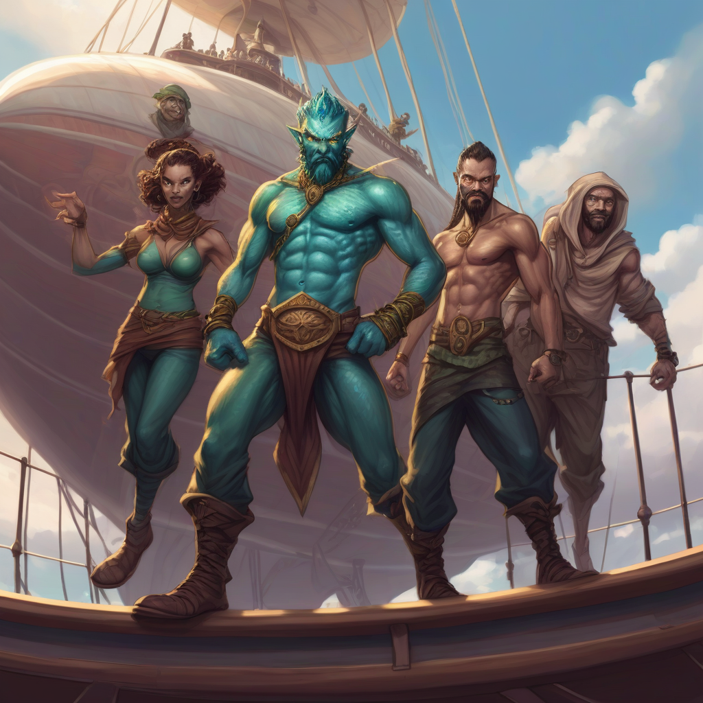

# Ravnica Airship Heist

## Summary

In this adventure story titled "Ravnica Airship Heist," a group of five PCs is tasked with capturing Lady Saves, a wanted Simic Combine 'disappearer' who will kidnapp an Izzet league goblin inventor named Grizmalgun and force him to steal and pilot an airship for her escape. The goal is to bring her to justice within the Tenth District before she flees to the Sixth District.

The story consists of several scenes:

1. A dawn raid on Growth Chamber Alpha-3, where the PCs face two Category 1 Krasis and discover evidence leading to Lady Saves' plans and Grizmalgun as her ally.
2. An investigation into Grizmalgun's workshop, where traps are set by Simic allies and the PCs must navigate the dangerous environment to find more clues.
3. A pursuit to catch up with the airship before it takes off. The PCs use their contacts to obtain Griffins or Skyjek Rocs for aerial combat against Lady Saves.
4. Optional aerial battle scene, where the PCs face three Harpies as interference during their pursuit.
5. A climactic airship heist battle, where the PCs engage in combat with Lady Saves, her Simic thugs, a Krasis Stage 1, and a frightened Grizmalgun, who can be persuaded to join them.
6. A crash-landing of the airship, where the PCs must use various skills to level out the airship and ensure a safe landing in a Rubble Pit. They also encounter Gruul, which they may need to negotiate with using social skills.

## Cast

**Lady Saves** is a cruel, heartless Simic biomancer who seeks only to further her own glory by a series of increasingly dangerous experiments. She appears as a beautiful, if otherworldly, woman, and has a thin pair of butterfly wings that are usually kept folded and hidden behind her back. Likewise, if she needs it, a pair of concealed tentacles can emerge from her body.

**Grizmalgun**   is a scatterbrained and disorganised goblin inventor who usually works in the harnessing of elemental powers. He has worked many times on maintaining the Tenth District’s airships, and so is in a prime position to steal one. While he has no time for Lady Saves, the chance to actually fly one of his creations has made him relatively sympathetic to her cause – and the chance to start again in the Sixth District also appeals, as he has a long list of debts from previous experiments.

## Mission Briefing - 4 o'clock in the morning
Council Member of the Azorius Senate:
```
Meine Damen und Herren, wir sind auf eine ernste Angelegenheit aufmerksam geworden. Eine gefährliche Kriminelle namens Lady Siwiss, die sowohl vom Azorius-Senat als auch vom Simic-Kombinat gesucht wird, steht kurz davor, unserem Zugriff zu entkommen. Sie hat zahlreiche Verbrechen gegen den Gildenpakt begangen und bedroht mit ihren Handlungen die Ordnung von Ravnica.

Als vertrauenswürdiger Verbündeter des Azorius-Senats flehe ich euch an, diesem Aufruf zur Gerechtigkeit zu folgen. In diesem Moment wird ein Haftbefehl gegen Lady Siwiss ausgestellt, aber ich befürchte, dass die offiziellen Strafverfolgungsbehörden die Fluchtgefahr im Fall von Lady Siwiss unterschätzen könnten. Wir glauben, dass sie beabsichtigt, in den weit entfernten Sechsten Distrikt zu fliehen, wo sie ihre schändlichen Experimente ungehindert fortsetzen wird.

Wir brauchen Ihre einzigartigen Fähigkeiten und Ihren Mut, um Lady Siwiss zu fassen, bevor sie ihre abscheulichen Pläne verwirklichen kann. Die Zeit drängt; wir müssen schnell und entschlossen handeln, wenn wir diese Bedrohung in unserem Zuständigkeitsbereich vor Gericht bringen wollen.

Die Sicherheit und Stabilität von Ravnica hängen von eurem Erfolg ab. Bitte nehmen Sie diesen Auftrag an und stellen Sie die Ordnung in unserer großen Stadt wieder her.
```
With each PC, ask why they are dedicated to finding Lady Saves – what has she done to them, their Guild or their family. Let them know the terms of the warrant – it applies within the Tenth District, and so it is imperative that they don’t let her escape.

## Scene 1 - Dawn Raid on Growth Chamber Alpha-3
```
Als ihr euch der Wachstumskammer Alpha-3 nähert, die sich im fünften Bezirk des Zehnten Distrikts in Zonot Sieben befindet, herrscht eine unheimliche Stille. In der Luft liegt ein säuerlicher Gestank, der eure Augen brennen und tränen lässt. Die Kammer selbst ist ein großer, schwach beleuchteter Raum, in dessen Mitte sich zwei grünliche Becken befinden. Hinter den Becken liegt ein Schreibtisch mit Geräten und Notizen, die von Lady Siwiss kürzlicher Beschäftigung durcheinander gebracht wurden.

In der Ferne sind verlassene Wohnräume zu sehen, deren Türen leicht angelehnt sind, als ob sie eilig verlassen worden wären. Insgesamt herrscht eine Atmosphäre der Verlassenheit und Eile, mit einem Hauch von Gefahr, die in den Schatten lauert. Die Luft ist schwer vor Spannung, und irgendetwas sagt Ihnen, dass Sie in dieser vergessenen Ecke des Zehnten Bezirks nicht allein sind.
```

### Trap in Pools or upon Searching the Desk

#### Two Concious Green Slimes with Acidic Skin Power
| Monster  | HD | DF | MV | Special                         |
|--------------|----|----|----|---------------------------------|
| Concious Green Slimes | 1  | 4  | 5/20 | Acidic Skin                      |

Acidic Skin: The Concious Green Slimes possess a thick, corrosive layer of skin that can cause 1 damage to those who come into contact with it.

#### In the Desk
- A detailed plan for airship piloting, which has had several notes left in it
- A list of Izzet league contacts – with notes next to them, each crossed out. Only one, Grizmalgun, a goblin airship inventor, remains
- A guide book to the Sixth District, far across Ravnica

## Scene 2 - Grizmalgun's Workshop
```
Wenn ihr der Spur folgst, die Lady Siwiss hinterlassen hat, kommt ihr in Grizmalguns Werkstatt an - ein zweistöckiges Gebäude im Herzen des Zehnten Bezirks. Die Luft ist dick mit dem Geruch von unvollendeten Experimenten und den Nachwirkungen einer überstürzten Flucht. Ein Gefühl des Unbehagens macht sich in euch breit, als euch klar wird, dass Lady Siwiss wissen könnte, dass die Jagd auf sie begonnen hat.
```


### Spies awaiting
Spies: Agi

### Trip Wire
To avoid: Wil+2
If fail: Double negative Agi or fall downstairs. A *Hybrid Spy* on the other side of the room triggers a mechanism to flood the lower level. If the place is not vacated within 15 rounds or the water is stopped, interaction with the generator will cause an explosion. 2 Hybrid Spies and 1 Hybrid Shocker will initiate a fight.

#### Two Concious Green Slimes with Acidic Skin Power
| Monster  | HD | DF | MV | Special                         |
|--------------|----|----|----|---------------------------------|
| Hybrid Spy | 1  | 2  | 15 |                       |
| Hybrid Shocker | 2  | 3  | 12 | Shock-Staff                      |

Shock-Staff: Deal 1 damage to everyone in water or 2 extra damage to everyone it directly hits.


```
Bei der Befragung der Simic können sie feststellen, dass Lady Siwiss schon lange weg ist - sie ist bereits an Bord des Luftschiffs. Bei einer gründlichen Durchsuchung der Werkstatt werden außerdem Beweise für einen Kampf gefunden - und Berechnungen für eine Flugroute. Die Überprüfung der Windgeschwindigkeiten und der Zeitangaben ergibt, dass das Luftschiff bereits in der Luft ist - es gibt keine Zeit zu verlieren, um es einzuholen!
```

## Interloop: Getting Flying Mounts (Griffins or Skyjek Rocs) or Airship
```
Als die Sonne über dem Zehnten Distrikt unterzugehen beginnt, erhebt ihr euch auf euren fliegenden Reittieren - Greifen oder Roks - in die Lüfte, um das Luftschiff von Lady Siwiss zu erwischen, bevor es am Horizont verschwindet. Der Wind rauscht durch eure Haare, während ihr an Höhe gewinnt, und ihr könnt das Luftschiff in der Ferne sehen, wie es sich gegen die untergehende Sonne abhebt.

Die Jagd hat begonnen, und es stand noch nie so viel auf dem Spiel. Mit jeder Sekunde, die verstreicht, entfernt sich Lady Siwiss weiter, ihr gestohlenes Luftschiff ist ein Leuchtfeuer der Gefahr und des Chaos am Himmel. Kannst du das Luftschiff ausmanövrieren und zur Strecke bringen, bevor es die Sicherheit des sechsten Bezirks erreicht? Nur deine Fähigkeiten, deine Entschlossenheit und deine Teamarbeit können jetzt über das Schicksal von Ravnica entscheiden.
```

## (Optional: Scene 3 - Aerial Battle)
```
Während du das Luftschiff von Lady Siwiss durch die unendlichen Weiten von Ravnica verfolgst, stellt sich dir eine unerwartete Herausforderung in Form von drei Harpyien. Diese finsteren Kreaturen haben sich in die Lüfte erhoben und sind fest entschlossen, euer Vorankommen zu verhindern. Ihr eindringlicher Gesang hallt im Wind wider, wenn sie eure Flugbahn unterbrechen.

Das verlockende Lied dieser Harpyien droht Ihre Verfolgung zu vereiteln, während Sie versuchen, ihren hypnotisierenden Melodien zu widerstehen und gleichzeitig das Luftschiff von Lady Siwiss im Auge zu behalten. Wirst du in der Lage sein, dieses neue Hindernis zu überwinden und Gerechtigkeit in die Lüfte von Ravnica zu bringen? Nur dein Mut, deine Gerissenheit und dein Teamwork können dich durch diese gefährliche Begegnung führen.
```
#### Three Harpies
| Monster  | HD | DF | MV | Special                         |
|--------------|----|----|----|---------------------------------|
| Harpy | 1  | 2  | 2/40 | Luring Song                      |

Luring Song: Makes everyone who hears the song follow the Harpies. Can be countered by having the animal mounts make noise (appropriate skill check)


## Scene 4 - Airship Heist
```
Nachdem Sie das Luftschiff von Lady SaSiwissves erfolgreich abgefangen haben, finden Sie sich an Bord eines Schiffes wieder, in dem es vor Gefahren und Intrigen nur so wimmelt. Das Innere ist eng, aber gut gepflegt, mit verschiedenen Ecken und Winkeln, die reichlich Deckung für Überraschungsangriffe oder strategische Positionierung bieten.

Im Hauptabteil befindet sich an der Vorderseite eine große Schalttafel, die von Lady Siwiss selbst bedient wird. Neben ihr steht ein Krasis, dessen bedrohliche Gestalt bereit ist, seinen Herrn zu verteidigen. Im Raum verstreut stehen vier simische Schläger, deren Augen entschlossen auf den Kampf warten.

Zu allem Überfluss ist ein verängstigt aussehender Grizmalgun an einen Käfig im hinteren Teil des Luftschiffs gekettet, dessen Erfindergeist zusammen mit seinem Leben gefangen gehalten wird. Wirst du in der Lage sein, diese furchterregenden Feinde zu besiegen und Lady Siwiss' Schreckensherrschaft ein Ende zu setzen? Das Schicksal von Ravnica hängt in der Schwebe, während sich dieser epische Kampf am Himmel entfaltet.
```

| Character | HD | DF | MV | Special                                          |
|-----------|----|----|----|--------------------------------------------------|
| Lady Siwiss (Cult Fanatic) | 3   | 6  | -- | Flight: Can fly at a speed of 40 feet.           |
| Krasis Stage 1             | 2   | 5  | 30/120 | Acidic Skin: Deals 1d4 acid damage on contact.     |
| Simic Thug                 | 1   | 3  | --   | Multiattack: Two unarmed attacks per round.       |
| Grizmalgun (Counterflux Blastseeker) | 2  | 5  | --  | Lightning Bolt: Can cast a lightning bolt once per day. |




## Scene 5 - Airship Crash!
```
Als das Luftschiff, das Sie betreten haben, unkontrolliert zu kippen und zu rollen beginnt, wird klar, dass Lady Siwiss aus Verzweiflung einen Bombenmechanismus eingebaut hat, der katastrophale Schäden verursachen kann. Da die Zeit knapp wird und Ihre Feinde immer verzweifelter werden, steht das Luftschiff am Rande der Katastrophe und sein Schicksal hängt am seidenen Faden. Das Innere des Schiffes liegt in Schutt und Asche, und Lady Siwiss und ihre Verbündeten versuchen verzweifelt, sich zu verteidigen oder ihre tödliche Vorrichtung zu aktivieren.

Gerade als die Hoffnung verloren scheint, müssen Sie schnell handeln, um die Situation zu stabilisieren. Während das Luftschiff auf eine Trümmergrube stürzt, die mit den Überresten vergangener Schlachten und eingestürzter Gebäude gefüllt ist, liegt es an Ihnen und Ihrem Team, eine Reihe von Geschicklichkeitsprüfungen zu bestehen, um den sicheren Untergang zu verhindern. Die Uhr tickt; könnt ihr zusammenarbeiten, um das Luftschiff - und euch selbst - vor einem vorzeitigen Ende zu bewahren? Ihre Augen suchen das Chaos im Inneren des Luftschiffs ab, auf der Suche nach allem, was Ihnen bei Ihrem verzweifelten Versuch zu überleben helfen könnte. Die Trümmergrube kommt immer näher, ihre zerklüfteten Kanten und bröckelnden Wände sind eine deutliche Erinnerung an den Ernst Ihrer Lage. Nur Ihr schnelles Denken, Ihre Kooperation und Ihre Entschlossenheit können Ihnen helfen, diese erschütternde Tortur zu überstehen.
```

#### Preventing a total crash
To prevent, the crew needs 5 successes before having 4 failures, e.g.
- repair the rigging
- repair the air elemental holding wards
- climb onto the rigging and hold it in place
- get Grizmalgun to help – once the bomb goes off he is very keen on observing the carnage instead of helping
- disarm further bomb mechanism
- find a good landing spot
- prepare ship for crash landing
- remember past airship crashes
- look for ship vulnerabilities and counteract them

```
Success Outro:

Herzlichen Glückwunsch! Du hast den tückischen Abstieg von Lady Siwiss' Luftschiff erfolgreich gemeistert, indem du verschiedene Mechanismen geschickt manipuliert und die Fähigkeiten deiner Teamkollegen genutzt hast, um eine Katastrophe abzuwenden. Der Bombenmechanismus wurde neutralisiert und das Luftschiff landet sanft in der Trümmergrube, wo eine Gruppe von Gruul auf dich wartet.

Mit Hilfe deiner sozialen Fähigkeiten und der Gefangennahme von Lady Siwiss gelingt es dir, für dich und dein Team eine sichere Passage durch die grimmigen Krieger auszuhandeln. Der kriminelle Drahtzieher wird zur Rechenschaft gezogen, und Ravnica kann wieder aufatmen, da der Himmel von der Bedrohung befreit ist, die Jahre des Friedens und der Ordnung zu zerstören drohte. Euer Mut, eure Gerissenheit und eure Zusammenarbeit haben den Tag gerettet - gut gemacht!

Failure Outro:

Das Unglück nimmt seinen Lauf, als das Luftschiff auf die Trümmergrube stürzt. Sein Schicksal ist besiegelt, weil es Ihnen nicht gelingt, die Detonation der Bombe zu verhindern. Lady Siwiss freut sich über dein Versagen und ihr düsteres Lachen hallt durch das chaotische Luftschiff, während du einem vorzeitigen Ende entgegensinkst.

Die Trümmergrube wartet mit zerklüfteten Kanten und bröckelnden Wänden, bereit, weitere Opfer in ihre ewige Umarmung zu nehmen. Als das Luftschiff mit den Ruinen unter ihm kollidiert, findet deine Reise ein bitteres Ende. Ravnica wird eine andere Gruppe von Helden finden müssen, um es vor der nächsten Bedrohung zu retten - denn ihr habt versagt, und die Konsequenzen dieses Versagens werden noch jahrelang zu spüren sein.
```